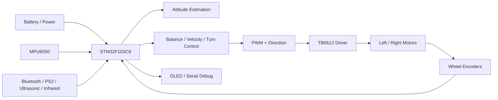

# Balance Car

基于 `STM32F103C8` 的两轮自平衡小车项目，工程使用 `Keil uVision + STM32 Standard Peripheral Library`，包含姿态采集、姿态解算、编码器测速、三环控制、蓝牙遥控、OLED 显示、超声波扩展和 Flash 参数保存等模块。

## 项目亮点

- 具备完整的平衡车主控制链路，可直接作为参考基线
- 保留了 Keil 工程、驱动层、控制层和调试接口，便于对照学习
- 同时提供“原始参考工程”和“从空白工程复现路线”两条使用路径
- 已整理仓库说明文档，适合后续继续扩展成你自己的长期项目

## 项目定位

这个仓库适合作为：

- 自平衡小车的完整参考工程
- `STM32F1` 裸机项目的学习样例
- 从空白工程逐步复现平衡车的对照基线

这个仓库目前保留的是一套已经能跑通主链路的工程实现，更偏“成熟教学样例”，不是刻意重构过的工业级模板。

## 功能概览

- `MPU6050` 姿态采集
- `Mahony` 姿态解算
- 左右轮编码器测速
- 角度环、速度环、转向环控制
- `TB6612` 电机驱动与 PWM 输出
- 蓝牙遥控
- OLED 实时显示
- 电池电压检测
- 超声波跟随 / 避障扩展
- 内部 Flash 参数保存

## 推荐使用方式

这个仓库最适合下面两种用法：

1. 把当前工程当作参考答案，阅读、对照、验证思路
2. 在仓库里的 `from_scratch/` 目录下，从最小系统开始逐步搭你自己的版本

如果你的目标是“自己写一遍，还能随时回退”，第二种方式会更稳。

## 系统框图

## 软件主流程

1. 上电后初始化串口、蓝牙、PWM、电机方向脚、编码器、I2C、MPU6050、OLED、ADC、定时器和中断。
2. `SysTick` 以 `5ms` 周期执行高频闭环：
   读取 IMU -> 姿态解算 -> 读取编码器 -> 三环控制 -> 输出合成 -> 电机驱动。
3. 主循环负责低频任务：
   蓝牙消息解析、超声波触发测距、电压检测、OLED 刷新。

## 控制结构

- 角度环：PD，负责让车体站稳
- 速度环：PI，负责前进后退速度
- 转向环：P + 陀螺反馈，负责左右转向

电机输出合成方式：

- 左轮输出 = 角度环 + 速度环 + 转向环
- 右轮输出 = 角度环 + 速度环 - 转向环

## 关键硬件与引脚

| 模块 | 资源 | 引脚 |
| --- | --- | --- |
| 调试串口 | USART1 | PA9 TX, PA10 RX |
| 蓝牙模块 | USART3 | PB10 TX, PB11 RX |
| MPU6050 软件 I2C | GPIO | PC14 SCL, PC15 SDA |
| 电机 PWM | TIM2 CH1/CH2 | PA0, PA1 |
| 电机方向控制 | GPIO | PA4, PA5, PB3, PB4, PA12(STBY) |
| 左编码器 | TIM3 | PA6, PA7 |
| 右编码器 | TIM4 | PB6, PB7 |
| 电池电压采样 | ADC1 CH2 | PA2 |
| 超声波 Trig | GPIO | PA3 |
| 超声波 Echo | EXTI | PC13 |
| OLED 软件 I2C | GPIO | PB0 SDA, PB1 SCL |
| PS2 手柄 | GPIO | PB12, PB13, PB14, PB15 |
| 红外循迹 | GPIO | PB9, PB8, PB5, PA15 |

## 硬件清单建议

最少可运行组合：

- `STM32F103C8` 最小系统板
- `MPU6050`
- `TB6612` 电机驱动
- 两个减速电机
- 两路编码器
- 2S 锂电或等效电源

推荐调试扩展：

- 蓝牙串口模块
- 0.96 寸 OLED
- 超声波模块
- 红外循迹模块
- 串口转 USB 调试器

## 目录结构

- `core/`: Cortex-M3 内核和启动文件
- `driver/`: 外设驱动、算法与控制代码
- `st_lib/`: STM32 标准外设库
- `user/`: 工程入口、Keil 工程文件、中断和系统配置
- `docs/`: 项目分析与复现文档
- `from_scratch/`: 给你自己从 0 开始搭建的新工程骨架

## 开发环境

- MCU: `STM32F103C8`
- IDE: `Keil uVision`
- Toolchain: `ARMCC`
- Library: `STM32 Standard Peripheral Library`

## 快速开始

1. 使用 `Keil uVision` 打开 `user/balance_car.uvprojx`
2. 连接对应硬件模块
3. 编译并下载到 `STM32F103C8`
4. 上电后先观察串口、OLED 和电机方向是否正常
5. 首次调试建议先悬空轮子，确认编码器、IMU 和电机控制方向正确

## 推荐学习路径

建议按下面顺序阅读和验证：

1. `user/main.c`，先看初始化顺序和主循环职责
2. `driver/systick.c`，看高频闭环到底做了什么
3. `driver/controller.c`，看三环控制怎么合成
4. `driver/mpu6050.c` 和 `driver/imu.c`，看姿态获取与解算
5. `driver/pwm.c`，看电机、编码器和输出方向控制

## 从零复现建议

如果你不想直接改这份参考工程，建议采用“原工程只读，新工程分阶段复现”的方式：

1. 新建一个空白工程
2. 先跑通串口、LED、下载链路
3. 再实现 PWM 与电机驱动
4. 再接入编码器
5. 再接入 MPU6050 和姿态解算
6. 最后逐步叠加三环控制

详细路线见：

- [项目分析文档](docs/PROJECT_OVERVIEW.md)
- [从空白工程复现路线](docs/FROM_SCRATCH.md)
- [从 0 开始的新工程骨架](from_scratch/README.md)

## 仓库说明

- 编译输出目录 `out_file/` 已通过 `.gitignore` 排除
- Keil 的个人界面状态文件已忽略，避免污染提交历史
- 当前主入口文件为 `user/main.c`
- 你后续如果自己写新版本，建议只在 `from_scratch/` 下推进，保留当前工程为稳定参考
